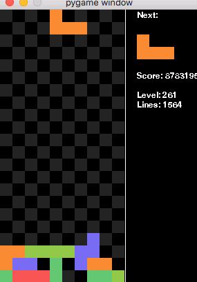

# Tetris AI

A tetris AI implemented using q-learning, a type of reinforcement learning.

The AI is mine, but the tetris game is not.  Credit to Kevin Chabowski for the tetris game.

## Usage

Run `python tetris.py` to see the AI in action.

To tweak individual parameters like epsilon, the discount factor, alpha, etc., look in the `__init__` method of `TetrisReinforcementLearner` in `tetris_reinforcement_learner.py`.
